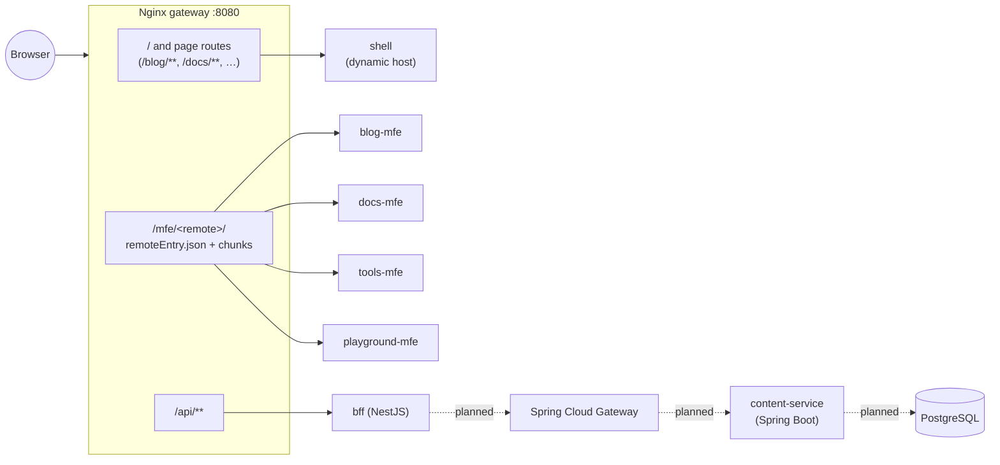

# TG Labs

> **Build. Explore. Share.** — a personal developer portal for technical writing,
> engineering documentation, developer utilities and interactive experiments.

TG Labs is not a single blog application. It is a **micro frontend platform**:
an Angular **Shell** (host) plus four independently buildable and deployable
Angular **Remotes**, connected at runtime with
[Native Federation](https://www.npmjs.com/package/@angular-architects/native-federation)
and managed in one **Nx** monorepo.

| Section    | Application      | What it owns                                                |
| ---------- | ---------------- | ----------------------------------------------------------- |
| Home       | `shell`          | Global layout, navigation, home page, 404, error states     |
| Blog       | `blog-mfe`       | Article list/detail, categories, tags, search               |
| Docs       | `docs-mfe`       | Documentation landing, navigation, page viewer, search      |
| Tools      | `tools-mfe`      | JSON Formatter/Validator, Base64, JWT decoder (decode only) |
| Playground | `playground-mfe` | Experiments; first demo: _Signals Lab_                      |
| API        | `bff`            | NestJS Backend-for-Frontend (`/api/health` today)           |

## Architecture



1. The browser always talks to one origin (the gateway).
2. The Shell boots, fetches **`federation.manifest.json`** (remote name → `remoteEntry.json` URL) and initialises Native Federation.
3. Navigating to `/blog/**` triggers `loadChildren`, which loads the Blog remote's exposed **`./routes`** module from `/mfe/blog/`.
4. If a remote is unreachable, the Shell renders a "temporarily unavailable" page for that section; the rest of the site keeps working.

More detail: [docs/architecture.md](docs/architecture.md). All guides are indexed in [docs/README.md](docs/README.md).

## Technology stack

Versions were selected on 2026-10-09 as the latest mutually compatible stable releases.

| Area                  | Choice                                     | Version       |
| --------------------- | ------------------------------------------ | ------------- |
| Runtime               | Node.js (LTS)                              | 24.21.0       |
| Package manager       | npm                                        | 11.x          |
| Monorepo              | Nx (`@nx/angular`, `@nx/js`, `@nx/vitest`) | 23.3.0        |
| Framework             | Angular (standalone, zoneless, strict)     | 22.2.2        |
| Language              | TypeScript                                 | 6.0.3         |
| Micro frontends       | `@angular-architects/native-federation`    | 22.2.2        |
| Styling               | Tailwind CSS (`@tailwindcss/postcss`)      | 4.3.3         |
| Unit tests            | Vitest (`@angular/build:unit-test`)        | 4.x           |
| BFF                   | NestJS                                     | 12.1.2        |
| Static serving / edge | Nginx (`nginxinc/nginx-unprivileged`)      | 1.29 (alpine) |

Compatibility decisions:

- **Node 24 LTS.** Angular 22 requires Node `^22.22.3 || ^24.15.0`.
- **Angular 22.2 rather than Nx's default 22.1.** Native Federation 22.2.2 requires `@angular/build ~22.2.0`; Nx 23.3 supports Angular `>=20 <23`.
- **TypeScript 6.0.** This is the range Angular 22 supports (`>=6.0 <6.1`); TypeScript 7 is not supported yet.
- **NestJS 12 without `@nx/nest`.** `@nx/nest` 23.3 only supports Nest `<12`, so the BFF uses Nx `run-commands` with `tsc`.
- **Native Federation only.** There is no Webpack Module Federation configuration anywhere.

## Repository structure

```text
tg-labs-mfe/
├── apps/
│   ├── shell/            # Host: layout, home, 404, remote loading
│   ├── blog-mfe/         # Remote: blog
│   ├── docs-mfe/         # Remote: documentation
│   ├── tools-mfe/        # Remote: developer tools
│   └── playground-mfe/   # Remote: experiments
├── libs/
│   ├── shared-ui/        # Buttons, cards, badges, state messages, design tokens
│   ├── shared-layout/    # Container, split (sidebar) layout
│   ├── shared-models/    # DTOs and API contracts (types only)
│   ├── shared-utils/     # Framework-independent helpers
│   └── shared-config/    # Site constants + Shell/Remote route contract
├── backend/
│   ├── bff/              # NestJS BFF (runnable)
│   ├── api-gateway/      # Planned: Spring Cloud Gateway
│   └── services/content-service/  # Planned: Spring Boot content API
├── database/             # Planned: migrations and seed data
├── docker/               # One Dockerfile per application
├── infra/nginx/          # Gateway config + per-app Nginx templates
├── infra/postgres|redis/ # Planned infrastructure notes
├── compose/              # docker-compose base + dev/prod overrides
├── docs/                 # Architecture, local development, deployment
└── .github/workflows/    # CI and manual image publishing
```

Each application follows the same layout:

- `src/app/<name>.routes.ts`: the exposed route contract.
- `features/`: one folder per feature.
- `data-access/`: content stores.
- `<name>-layout.ts`: the remote root component, which carries the remote's styles.

## Prerequisites

- Node.js **24.21.0** (see `.nvmrc`, e.g. `nvm use`)
- npm 11 (bundled with Node 24)
- Docker Engine with Compose v2 (only for the container setup)

## Installation

```bash
npm ci
```

## Local development

Every application runs its own dev server.

| App              | Port | Command                       |
| ---------------- | ---- | ----------------------------- |
| `shell`          | 4200 | `npx nx serve shell`          |
| `blog-mfe`       | 4201 | `npx nx serve blog-mfe`       |
| `docs-mfe`       | 4202 | `npx nx serve docs-mfe`       |
| `tools-mfe`      | 4203 | `npx nx serve tools-mfe`      |
| `playground-mfe` | 4204 | `npx nx serve playground-mfe` |
| `bff`            | 3000 | `npx nx serve bff`            |

Run the whole frontend at once and open <http://localhost:4200>:

```bash
npm start   # nx run-many -t serve -p shell blog-mfe docs-mfe tools-mfe playground-mfe
```

Common tasks:

```bash
npx nx run-many -t lint        # or: npm run lint
npx nx run-many -t test        # or: npm test
npx nx run-many -t build       # production builds -> dist/
npx nx affected -t lint test build
npx nx format:check
npx nx graph                   # project graph
```

A remote can also be opened on its own (e.g. <http://localhost:4203/tools>). It then shows a "standalone dev mode" banner. See [docs/local-development.md](docs/local-development.md).

## Testing Native Federation

With all dev servers running:

1. `curl http://localhost:4201/remoteEntry.json`. Each remote should expose `./routes`.
2. Open <http://localhost:4200>, then click _Blog_, _Docs_, _Tools_ and _Playground_. The header and footer stay mounted.
3. Refresh a nested route, e.g. <http://localhost:4200/blog/angular-signals-in-practice>.
4. Stop one remote (e.g. `docs-mfe`) and open <http://localhost:4200/docs>. You get the "Docs is temporarily unavailable" page while the other sections still work.

## Docker Compose

```bash
cp .env.example .env
docker compose --env-file .env -f compose/docker-compose.yml up --build -d
# open http://localhost:8080
docker compose --env-file .env -f compose/docker-compose.yml ps
docker compose --env-file .env -f compose/docker-compose.yml down
```

- Every image is built from the **repository root** (`context: ..`), using `docker/<app>.Dockerfile`.
- The gateway only waits for the Shell to be healthy. Remotes and the BFF are optional at start-up.

See [docs/deployment.md](docs/deployment.md) for image details, overrides and VPS notes.

## Nginx routing strategy

| Path              | Routed to                              | Why                                                    |
| ----------------- | -------------------------------------- | ------------------------------------------------------ |
| `/mfe/<remote>/…` | `<remote>` container (prefix stripped) | Federation files: `remoteEntry.json` and hashed chunks |
| `/api/…`          | `bff:3000`                             | Reserved for the Backend-for-Frontend                  |
| everything else   | `shell:8080`                           | Home, page routes (`/blog/<slug>`), global 404         |

Page URLs such as `/blog/my-article` are **never** sent to the Blog container. The Shell serves `index.html` for every page route, then loads the Blog's code from `/mfe/blog/`. Keeping these two path spaces separate is what makes deep links and refreshes work.

Caching:

- `*.json` (federation metadata) and HTML are served with `no-cache`.
- Content-hashed `*.js` / `*.css` files are served as `immutable` for one year.

## Current limitations

- Content is local mock data (blog articles, docs pages, homepage features). There is no CMS or database yet.
- Remote styling: each remote ships its own Tailwind utilities, scoped to its root element. Utilities are therefore duplicated between apps (a few KB gzipped each).
- `index.html` contains a small inline theme script, so a strict CSP needs a hash for it. No CSP is configured yet.
- The BFF image installs every production dependency in the workspace, including Angular (about 416 MB). A dedicated BFF dependency manifest would shrink it.
- The Java services (Spring Cloud Gateway, Content Service), PostgreSQL and Redis are planned but not scaffolded.
- There are no end-to-end tests in CI yet. Federation was verified with a local Playwright smoke run; see `docs/local-development.md`.

## Roadmap

1. **Content backend:** a Spring Boot Content Service with PostgreSQL (migrations in `database/`), exposed through Spring Cloud Gateway and consumed by the BFF.
2. **BFF integration:** replace the mock stores in the Blog/Docs remotes and the homepage with `/api` calls; add the shared HTTP client and error handling.
3. **E2E in CI:** Playwright smoke tests against the Docker Compose stack.
4. **Deployment:** publish images to GHCR (`Publish images` workflow), add a VPS rollout job, and put Cloudflare (DNS, TLS, CDN) in front of the gateway.
5. **Content pipeline:** Markdown/MDX into the shared `ContentBlock` model.
