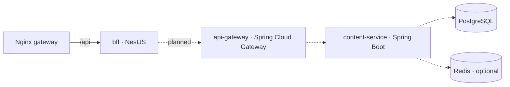

# Architecture

## Goals

- Each product area (Blog, Docs, Tools, Playground) can be built, versioned and deployed independently.
- Visitors experience a single website with one layout, one navigation and consistent styling.
- One Shell image and one image per remote work in every environment, configured at runtime.

## Applications

| Project          | Type          | Federation role | Exposes    |
| ---------------- | ------------- | --------------- | ---------- |
| `shell`          | Angular app   | dynamic host    | —          |
| `blog-mfe`       | Angular app   | remote          | `./routes` |
| `docs-mfe`       | Angular app   | remote          | `./routes` |
| `tools-mfe`      | Angular app   | remote          | `./routes` |
| `playground-mfe` | Angular app   | remote          | `./routes` |
| `bff`            | NestJS (Node) | —               | `/api/*`   |

### Shell responsibilities

- Global header, navigation, theme toggle (light/dark), footer.
- Home page, About page, global 404.
- Top-level route registration and remote loading.
- Loading indicator while a remote is fetched, and a fallback page when it fails.

The Shell contains no blog, docs or tools business logic.

### Remote responsibilities

Each remote exports `routes` from `src/app/<name>.routes.ts`. The root route renders a `<name>-layout` component, which owns:

- the section's secondary navigation, and
- the remote's stylesheet (see [Styling](#styling)).

Remotes keep their data access in `data-access/` and features in `features/`.

## Native Federation

### Configuration

Each app has a `federation.config.mjs`:

- `shared`: built with `fromPackageJson(...)`, so `@angular/*` and `rxjs` are shared as **strict-version singletons**. The browser downloads Angular once.
- `sharedMappings: []`: workspace libraries (`@tg-labs/*`) are **bundled into each app** rather than shared at runtime. A remote therefore never depends on the Shell's copy of a library, which keeps deployments independent.
- `skip`: server-only packages (`@nestjs/*`, `reflect-metadata`) and unused RxJS entry points.

Nx targets per Angular app:

| Target           | Executor                                      | Purpose                                        |
| ---------------- | --------------------------------------------- | ---------------------------------------------- |
| `build`          | `@angular-architects/native-federation:build` | Federation build (wraps `esbuild`)             |
| `esbuild`        | `@angular/build:application`                  | Underlying Angular application build           |
| `serve`          | `@angular-architects/native-federation:build` | Federation dev server (wraps `serve-original`) |
| `serve-original` | `@angular/build:dev-server`                   | Angular dev server on the app's port           |
| `test`           | `@angular/build:unit-test`                    | Vitest unit tests                              |
| `lint`           | inferred by `@nx/eslint/plugin`               | ESLint + module boundaries                     |

### Runtime flow

1. `apps/shell/src/main.ts` calls `initFederation('federation.manifest.json')`.
   - Any remote whose `remoteEntry.json` cannot be fetched is skipped (non-strict mode), so the Shell always boots.
   - If the manifest itself fails, the Shell still boots, and every remote section shows its fallback page.
2. The `loadRemoteModule` function returned by `initFederation` is provided to the app through the `REMOTE_MODULE_LOADER` injection token.
3. `loadRemoteRoutes(REMOTES.blog)` (in `core/federation/load-remote-routes.ts`) is the `loadChildren` callback for `/blog`. It:
   - loads `./routes` from `blog-mfe` (15 s timeout), and
   - validates that the module exports `routes`.
   - On failure, it returns a catch-all route rendering `RemoteUnavailable`.
4. Remote routes are relative. They are mounted under the Shell's `/blog`, `/docs`, `/tools` and `/playground` routes, and anything unmatched falls through to the Shell's `**` 404.

### Route contract

The contract lives in `@tg-labs/shared-config` (`REMOTES`, `REMOTE_ROUTES_MODULE`). For each remote:

- **`name`**: the federation name. It must match `federation.config.mjs` and the manifest key.
- **`basePath`**: the Shell mount point. Remotes use the same path when running standalone.
- **`./routes`**: the exposed module, with a named export `routes`.

Remote URLs are deliberately **not** in the contract. They come from the runtime manifest:

| Environment            | Manifest source                                         | Example URL                              |
| ---------------------- | ------------------------------------------------------- | ---------------------------------------- |
| Local dev servers      | `apps/shell/public/federation.manifest.json`            | `http://localhost:4201/remoteEntry.json` |
| Docker / VPS (gateway) | written at container start from `REMOTE_*_URL` env vars | `/mfe/blog/remoteEntry.json`             |

## Styling

Tailwind CSS v4 is configured CSS-first:

- **`libs/shared-ui/src/styles/tokens.css`**: `@theme` tokens (neutral zinc palette, one teal accent, font stacks) and a class-based `dark` variant.
- **`libs/shared-ui/src/styles/base.css`**: global base layer. It is imported only by application-level `styles.css` files.

A remote's global `styles.css` is **not** loaded when the remote runs inside the Shell. Each remote therefore attaches its own stylesheet to its root layout component (`ViewEncapsulation.None`). That stylesheet generates utilities only for the remote's own sources and the shared libraries.

Those utilities are **scoped to the remote's root element** (e.g. `tg-blog-layout .grid`). Without scoping, a second Tailwind stylesheet would override the Shell's responsive utilities by source order. Example: the remote's `.grid` beating the Shell's `md:hidden` broke the header on desktop.

The Shell's own `styles.css` uses `source(none)` and scans only `apps/shell` and the shared UI libraries. Its build is therefore independent of the remotes' code.

## Shared libraries and boundaries

| Library         | Tag           | May depend on             |
| --------------- | ------------- | ------------------------- |
| `shared-models` | `type:models` | nothing                   |
| `shared-utils`  | `type:util`   | models                    |
| `shared-config` | `type:config` | models                    |
| `shared-ui`     | `type:ui`     | ui, models, utils, config |
| `shared-layout` | `type:ui`     | ui, models, utils, config |

Apps (`type:app`) may only import `scope:shared` libraries. `@nx/enforce-module-boundaries` enforces this in `nx lint`. Remotes never import each other or the Shell.

## Backend (current and planned)

The BFF currently exposes only `GET /api/health`. The Java services, the database and Redis are intentionally deferred (see `backend/*/README.md`).
